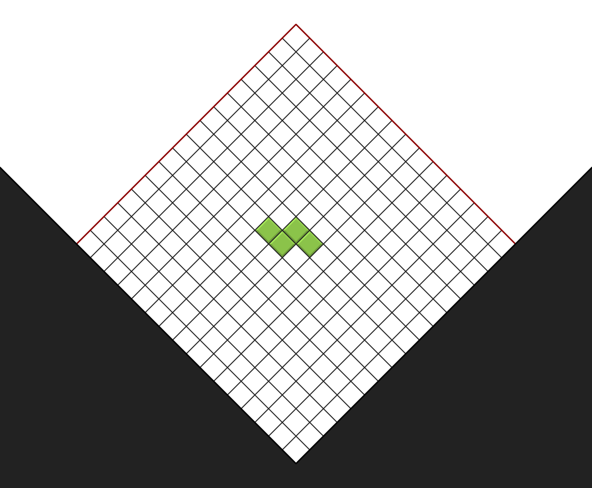
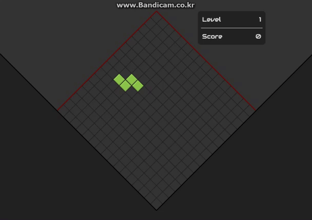
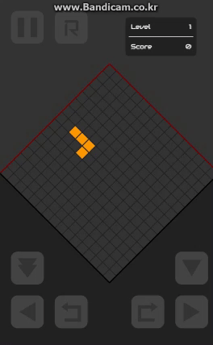

# Vertigoris
ver 0.0 (Not Release Yet)

## What is It?
- It a different kind of game resembling Tetris
- Each piece detracts from left-top or right-top side of the rumble-shape field

## How to Run
- Download this project
- run Vertigoris.html using ANY Web browser
(Tested on Chrome, Mobile Chrome, IE11, Edge)
- ???
- ENJOY!

## How to Play
- ←: Move left
- →: Move right
- ↓: Soft drop
- ↑: Rotate right
- Z: Rotate left
- SPACE: Hard drop (Instant drop)
- P: pause
- R: Reset

## Screenshot

